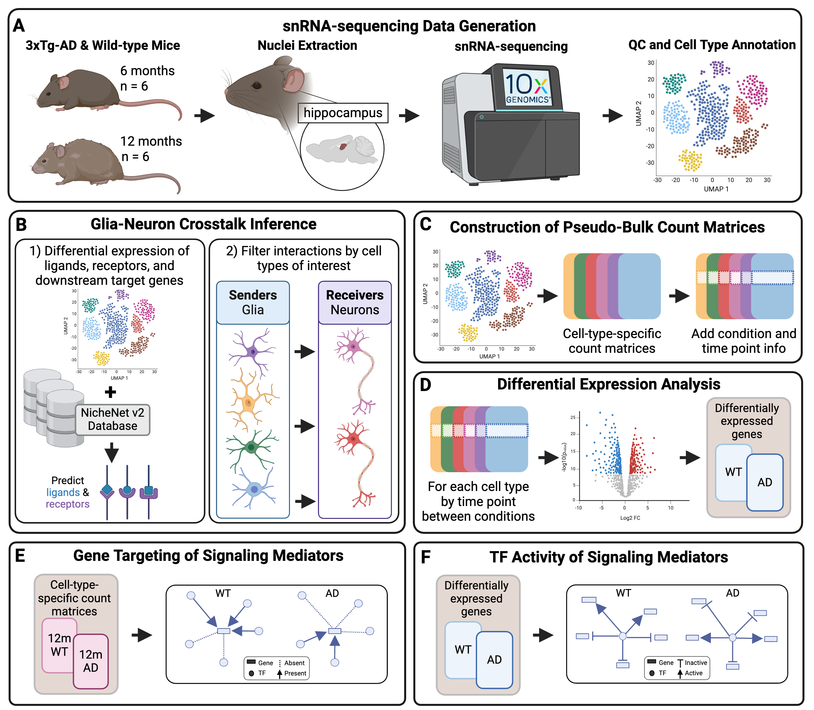

```{r setup, include=FALSE}
knitr::opts_chunk$set(echo = TRUE)
```

# Evaluation of altered cell-cell communication between glia and neurons in the hippocampus of 3xTg-AD mice at two time points

[](https://doi.org/10.1101/2024.05.21.595199) 

## Authors 

**Tabea M. Soelter<sup>1</sup>, Timothy C. Howton<sup>1</sup>, Elizabeth J. Wilk<sup>1</sup>, Jordan H. Whitlock<sup>1</sup>,  Amanda D. Clark<sup>1</sup>, Allison Birnbaum<sup>1,3</sup>, Dalton C. Patterson<sup>1</sup>, Constanza J. Cortes<sup>1,2</sup>, Brittany N. Lasseigne<sup>1</sup>**

1. Department of Cell, Developmental and Integrative Biology, Heersink School of Medicine, The University of Alabama at Birmingham, Birmingham, Alabama, United States of America

2. Leonard Davis School of Gerontology, University of Southern California, Los Angeles, California, United States of America

3. Department of Molecular, Cell and Developmental Biology, University of California, Los Angeles, Los Angeles, California, United States of America

## Project Overview 

We sequenced the hippocampus from female 3xTg-AD and wild-type (WT) littermates at 6 and 12 months (**Fig 1A**) to evaluate altered glia-neuron communication. Given how critical CCC between glia and neurons is for brain health and for AD pathology, we inferred differential CCC between 3xTg-AD and WT mice across time points and between these senders (astrocytes, microglia, oligodendrocytes, and OPCs) and receivers (excitatory and inhibitory neurons) of interest. We predicted differentially expressed ligand-receptor pairs and their downstream target genes (**Fig 1B**) and evaluated their similarity across cell types using the Jaccard Similarity Index (JI). We also assessed the global downstream effects of altered glia-neuron communication using pseudo bulk differential expression and functional enrichment analyses (**Fig 1C-D**). To determine AD-associated interactions, we compiled an AD risk gene set from the Molecular Signatures Database (MSigDB) and a recent Genome-wide association study (GWAS). Using gene regulatory information, we also predicted signaling mediators of AD-associated ligand-receptor-target pairings and characterized their expression, differential gene targeting, and transcription factor (TF) activity (**Fig 1E-F**).



## Scripts 
Data Alignment (Cell Ranger):
```{r echo=FALSE}
fs::dir_tree("src/cellranger/")
```

Ambient RNA removal (SoupX):
```{r echo=FALSE}
fs::dir_tree("src/soupX/")
```

Pre-processing (Seurat):
```{r echo=FALSE}
fs::dir_tree("src/seurat_preprocessing/")
```

CCC inference (MultiNicheNet), FEA (gprofiler2), and JI analyses:
```{r echo=FALSE}
fs::dir_tree("src/ccc/")
```

Pseudobulk and DEA analyses (DESeq2):
```{r echo=FALSE}
fs::dir_tree("src/pseudobulk_dea/")
```

Transcription factory activity analysis (decoupleR):
```{r echo=FALSE}
fs::dir_tree("src/bio_activity/")
```

GRN construction (PANDA) and gene targeting analysis:
```{r echo=FALSE}
fs::dir_tree("src/gene_targeting/")
```

Protein quantification:
```{r echo=FALSE}
fs::dir_tree("src/elisa/")
```

Manuscript figures:
```{r echo=FALSE}
fs::dir_tree("src/figures/")
```

## Code and Data Availability
Raw snRNA-seq data:   
[](https://www.ncbi.nlm.nih.gov/geo/query/acc.cgi?&acc=GSE261596)  
Processed data:  
[](https://zenodo.org/records/11043321)    
Docker images:   
[](https://zenodo.org/records/11042577)   
GitHub Repository:    
[](https://zenodo.org/records/11040825)    

## Docker
We performed analyses in docker with R versions 4.2.1 (GRN construction) and 4.2.3. (all other analyses). While individual Docker image tags are noted in every script, below is an overview of the analyses and their associated scripts:

Docker | Tag | Associated Analyses
--- | --- | ---
rstudio_aging_ccc | 1.0.0 | Pre-processing
rstudio_aging_ccc | 1.0.1 | CCC inference, FEA, JI, pseudo bulk DEA, plotting
rstudio_aging_ccc | 1.0.2 | CCC signaling networks, pseudo bulk DEA for TF activity, TF activity, plotting
rstudio_aging_ccc | 1.0.3 | gene targeting, ELISA analysis
setbp1_manuscript_panda_1.0.1 | latest | PANDA GRN construction

The repository for rstudio_aging_ccc Docker images can be found on Docker Hub at [tsoelter/rstudio_aging_ccc](https://hub.docker.com/r/tsoelter/rstudio_aging_ccc/tags) and the setbp1_manuscript_panda_1.0.1 Docker image can also be found on Docker Hub at [jordanwhitlock/setbp1_manuscript_panda_1.0.1](https://hub.docker.com/r/jordanwhitlock/setbp1_manuscript_panda_1.0.1/tags) 

## Lasseigne Lab 

[What is Happening in the Lasseigne Lab?](https://www.lasseigne.org/)


## Funding 

This work was supported in part by the UAB Lasseigne Lab funds, the NIA R00HG009678-04S1, the Alzheimer's of Central Alabama Lindy Harrell Predoctoral Scholar Program. 

## Acknowledgements 

We would like to thank the members of the Lasseigne Lab, specifically Vishal H. Oza and Emma F. Jones for their valuable input throughout this study.

[](https://choosealicense.com/licenses/mit/)
